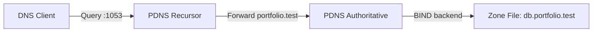

# Architecture

The project separates authoritative and recursive DNS responsibilities:

- `pdns-auth` serves the `portfolio.test` zone.
- `pdns-recursor` resolves recursive queries and forwards the local zone to `pdns-auth`.
- static container IPs make the forwarding path explicit and easy to reason about during demos.

## Why this design

- clean separation of concerns between recursive and authoritative DNS
- easy local demonstration without binding host port `53`
- explicit configuration that is simple to explain in a portfolio review

